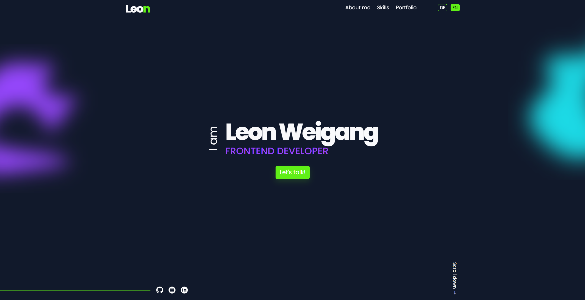

# Leon Weigang – Portfolio Website

## 📖 About the Project

This project is the personal portfolio website of **Leon Weigang**, created to present frontend development skills, selected projects, and contact information for professional applications.

The website is built entirely with **HTML, CSS, vanilla JavaScript, and PHP**. The visual design follows the supplied Figma/reference screenshots and is implemented as a responsive portfolio with dedicated legal pages.

---

## 📸 Preview

The portfolio includes dedicated project visuals for the currently presented work:



---

## ✨ Key Features

### 🏠 Portfolio Landing Page

- Full-height hero section with fixed header navigation
- About Me section with portrait, information blocks, and decorative background artwork
- Skills section with technology icons and an interactive learning popup
- Portfolio section with animated project cards
- Hover/focus overlay with GitHub and live-test actions
- Testimonial carousel with previous/next controls and direct selection
- Contact section with client-side validation and PHP form submission
- Footer with social links and legal navigation

### 🌐 Language Switching

- German and English language support
- Translated navigation, headings, content, form labels, placeholders and validation messages
- Translated accessibility labels and page titles
- Language changes without reloading the page
- Testimonial content switches together with the selected language

### 📱 Responsive Design

- Responsive support from **320px** mobile widths to large desktop screens
- Content width capped at **1440px**
- Responsive mobile navigation with burger menu
- Layout adjustments for narrow mobile devices
- Responsive portfolio cards, testimonials, contact form and footer
- Horizontal overflow is prevented on narrow viewports

### ♿ Accessibility

- Semantic HTML structure
- Skip-to-content links
- Visible keyboard focus states
- ARIA labels and expanded states for interactive navigation
- Accessible form error messages
- Keyboard-accessible testimonial and skill interactions
- Reduced-motion support with `prefers-reduced-motion`
- Minimum body/form text sizing maintained for narrow screens

### ✉️ Contact Form

- Required-field validation on blur
- Localized validation messages in German and English
- Red invalid-field feedback for required inputs
- Client-side validation before submission
- JSON payload sent with `fetch()` to `send_mail.php`
- JSON success/error handling
- Native PHP `mail()` delivery on the server

### 🎞️ Animations & Interactions

- Scroll reveal animations using `IntersectionObserver`
- Portfolio hover/focus animations
- Testimonial switching with arrows and indicator dots
- Mobile menu animation and state handling
- Skill learning popup with responsive positioning
- Hover and focus feedback for interactive elements

---

## 🛠️ Tech Stack

### Frontend

- HTML5
- CSS3
- Vanilla JavaScript (ES6+)
- Modular CSS files separated by responsibility in the `styles/` directory
- JavaScript Modules through the `scripts/` directory

### Backend

- PHP
- Native `mail()` for contact-form delivery

### Development & Documentation

- JSDoc documentation for JavaScript functions
- Git & GitHub
- VS Code Live Server or local PHP server

---

## 📁 Project Structure

```text
portfolio/
├── assets/
│   ├── aboutme_section/       # Portrait and About Me icons
│   ├── backgrounds/           # Decorative background graphics and glows
│   ├── contact_section/       # Contact-section assets
│   ├── footer_section/        # Footer social icons
│   ├── hero_section/          # Hero glows and social icons
│   ├── portfolio_section/     # Project preview images
│   ├── skills_section/        # Skill icons and Skills artwork
│   └── testimonial_section/   # Testimonial portraits
├── scripts/
│   ├── animations.js          # Scroll reveal animation logic
│   ├── app.js                 # Application initialization
│   ├── data.js                # Translation and testimonial data
│   ├── form.js                # Contact form validation and submission
│   ├── i18n.js                # Language switching and translations
│   ├── navigation.js          # Mobile navigation logic
│   └── testimonials.js        # Testimonial carousel logic
├── styles/
│   ├── animations.css         # Reveal and motion styles
│   ├── base.css               # Variables, reset and accessibility basics
│   ├── header-footer.css      # Header, navigation and footer styles
│   ├── legal.css              # Legal page styles
│   ├── responsive.css         # Responsive media queries
│   └── sections.css           # Main page section styles
├── index.html                 # Main portfolio page
├── legal-notice.html          # Legal notice page
├── privacy-policy.html        # Privacy policy page
├── script.js                  # JavaScript entry point
├── style.css                  # CSS entry point importing the modular styles
├── send_mail.php              # PHP endpoint for the contact form
└── README.md                  # Project documentation
```

The website favicon is stored at:

```text
assets/favicon.svg
```


---

## 🚀 Installation & Setup

### 1. Clone the repository

```bash
git clone <YOUR-REPOSITORY-URL>
cd <YOUR-REPOSITORY-FOLDER>
```

### 2. Run the project locally

Because the project uses JavaScript modules and a PHP endpoint, run it through a local web server instead of opening `index.html` directly with `file://`.

With the PHP development server:

```bash
php -S localhost:8000
```

Then open:

```text
http://localhost:8000/
```

Alternatively, VS Code Live Server can be used for frontend development. For the contact form, a PHP-enabled server is required.

---

## ✏️ Customization

Before publishing the website, review and update:

- GitHub and LinkedIn profile links
- Contact e-mail address
- Project GitHub and live-test links
- Project descriptions and technology lists
- Personal images and testimonial portraits
- Legal notice and privacy policy content
- Hosting information
- PHP mail configuration

The current project images and icons are already connected through the `assets/` directory.

---

## 📬 Contact Form Setup

The contact form sends the following JSON payload to `send_mail.php`:

```json
{
  "name": "Your name",
  "email": "your@email.com",
  "message": "Your message"
}
```

`send_mail.php` validates the request and uses PHP's native `mail()` function for delivery.

For production hosting, make sure:

- PHP is enabled
- The hosting provider supports `mail()`
- The configured recipient/sender address is valid
- The mail headers are accepted by the hosting environment
- HTTPS is enabled for the live website

The frontend expects a JSON response with:

```json
{
  "success": true
}
```

or an error response with `success: false`.

---

## 🌍 Localization

Translations are stored centrally in:

```text
scripts/data.js
```

The language logic is handled by:

```text
scripts/i18n.js
```

To add or change translated text, update both the German and English translation objects using the existing keys.

---

## 📐 Responsive Behavior

The portfolio is designed for:

- **320px+ mobile screens**
- **Tablet layouts**
- **Desktop layouts**
- **1440px maximum content width**
- Large displays with additional outer spacing while keeping the main content capped

The CSS is separated by responsibility so responsive changes can be made primarily in:

```text
styles/responsive.css
```

---

## ⚖️ Legal Pages

The project contains:

- `legal-notice.html`
- `privacy-policy.html`

These pages use the same header, navigation, language switching and footer system as the main portfolio.

Before publishing, all legal information should be reviewed and completed for the actual hosting provider, contact details, data processing and other legally required information. The included pages are project templates and are not legal advice.

---

## 🔧 Code Structure

The JavaScript is split into focused modules:

- `app.js` initializes the application
- `data.js` contains translations and testimonial data
- `i18n.js` handles localization
- `navigation.js` handles the mobile menu
- `testimonials.js` handles the testimonial carousel
- `form.js` handles validation and PHP submission
- `animations.js` handles scroll reveal animations

The CSS is split into:

- base styles
- header/footer styles
- page-section styles
- legal page styles
- animation styles
- responsive media queries

The root files `script.js` and `style.css` remain as simple entry points so the HTML pages keep a clean and stable structure.

---

## ✅ Project Status

The current project contains the complete modular portfolio implementation with:

- HTML/CSS/JavaScript frontend
- German/English localization
- Responsive layout down to 320px
- Accessible interaction states
- Portfolio hover interactions
- Interactive testimonials
- Responsive skill-learning popup
- Contact-form validation
- PHP/JSON contact-form submission
- Dedicated legal pages
- Modular `styles/` and `scripts/` folders

The remaining pre-publishing tasks are mainly personal content, legal review, hosting configuration and verification of the live mail setup.
